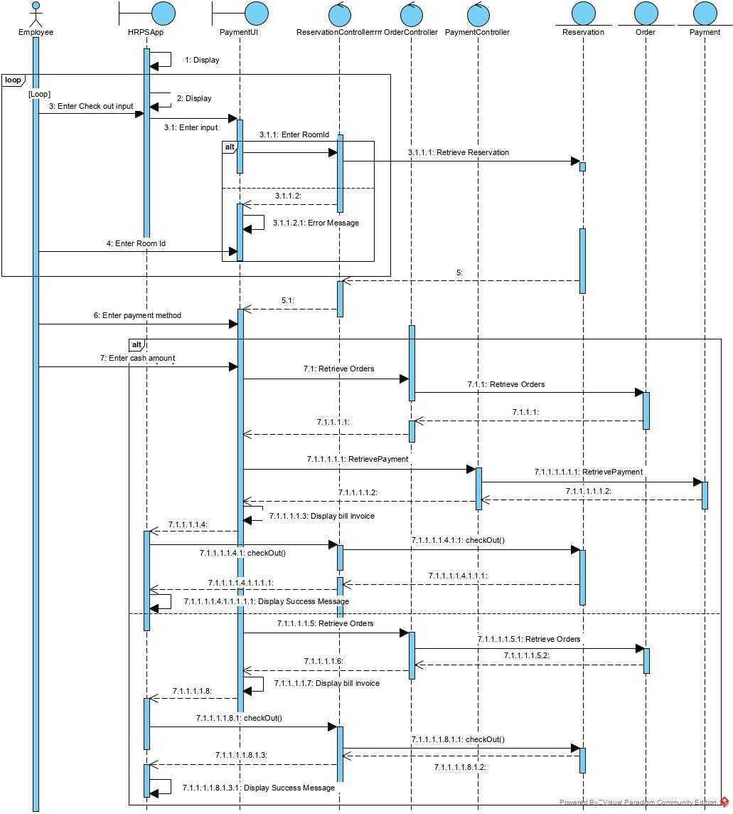

# CZ2002 Object-Oriented Design & Programming Project 2020 (Y1S2)
## Hotel Reservation and Payment System (HRPS). 
HRPS is an application to computerize the processes of making hotel reservation, recording of orders
and displaying of records. It is solely used by the hotel staff.

## Unified Modeling Language (UML)
### Class Diagram

Format: ![Class Diagram]

### Sequence Diagram
This sequence diagram is for check-out and print bill invoice method

## Assumptions made in this program:
- The currency will be in Singapore Dollar (SGD)
- There is no need to interface with external systems, e.g. Payment, printer, etc.
- Payments areis always successful.
- No need to log in - features
- No graphical interface for selection of rooms.
- The hotel has 48 rooms (of various type) from 02 – 07 level and the room number format is
&lt;2 digit floor level&gt;&lt;running number from 01&gt;, e.g. 0702.
- There will be no refund of fees for early check-out.

## Contributions
[Clive Goh](http://www.github.com/gohclive)

[Lyon Ng](http://www.github.com/lyonnhk) 

[Tan Kwok How](https://github.com/AveragePudding)

[Joash Yeong]
